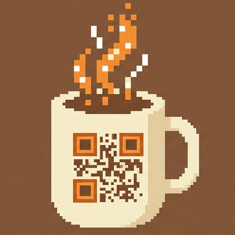
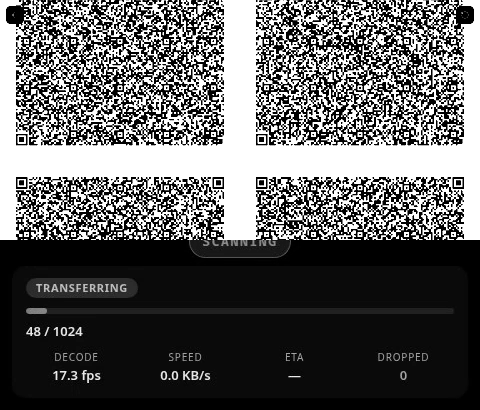
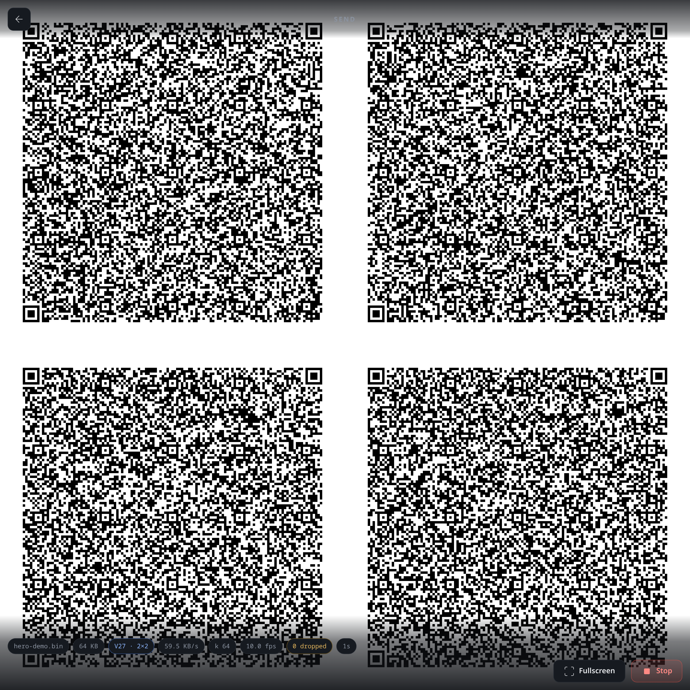
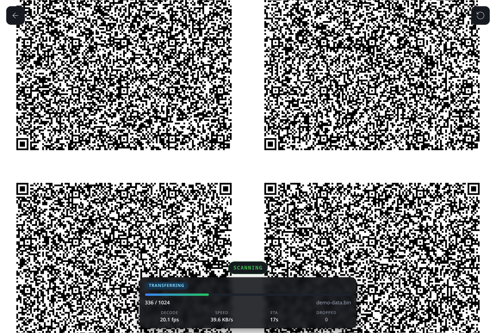
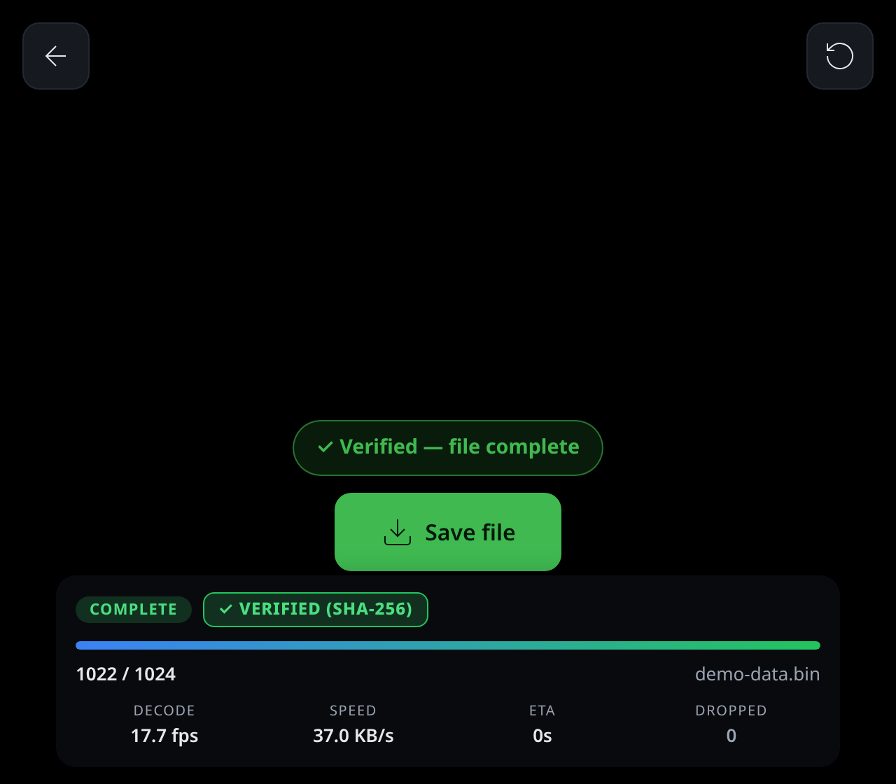

<div align="center">

<picture>
  <source media="(prefers-color-scheme: dark)" srcset="logo-white.png">
  <source media="(prefers-color-scheme: light)" srcset="logo.png">
  
</picture>

# QRStream

**Move files from one screen to another — as a continuous stream of QR codes.**

No network. No pairing. No server. One device broadcasts the file as a cycling
grid of QR codes; the other points its camera at the screen and the file
reassembles itself — RaptorQ fountain codec, SHA-256 verified, fully offline.

</div>

<p align="center">
  <a href="https://flutter.dev"></a>
  <a href="https://react.dev"></a>
  <a href="https://rust-lang.org"></a>
  <a href="LICENSE"></a>
  <br>
  <a href="https://github.com/BlackPool25/QRStream/actions/workflows/ci.yml"></a>
  <a href="https://github.com/BlackPool25/QRStream/releases"></a>
</p>

<p align="center">
  <i>Broadcast → scan → verified. Bytes never leave the room.</i>
</p>

<p align="center">
  <a href="#features">Features</a> · <a href="#quick-start">Quick start</a> · <a href="#how-it-works">How it works</a> · <a href="#honest-throughput">Honest throughput</a> · <a href="#platforms">Platforms</a> · <a href="#documentation">Docs</a> · <a href="#contributing">Contributing</a> · <a href="#license">License</a>
</p>

---



QRStream is two apps that speak the same wire protocol:

- **The Flutter app** (Linux desktop + Android) — the flagship. Broadcast from
  either platform, receive on Android.
- **The PWA** (any modern browser) — the zero-install demo and interop
  reference. Visually and wire-compatible with the Flutter app.

## Features

- **Zero network.** The transfer path never touches a socket. Both devices can
  be in airplane mode after first load.
- **No pairing, no handshake.** Point a camera at the screen and it just
  works — a receiver can join mid-broadcast.
- **No data loss.** Every frame is CRC-32C checked, erasures are repaired by a
  RaptorQ fountain codec, and the reassembled file is SHA-256 verified before
  it is ever offered for saving. A mismatch is surfaced, never silently saved.
- **No encryption — deliberately.** Same-room visual broadcast; anything the
  camera can see can be read. See the [threat model](docs/THREAT-MODEL.md).
- **Tunable throughput.** Display fps (12–30), bytes per tile (1/2/2.5 KB) and
  tile layout (1×1 → 3×3, including 1×2/2×1 dual lanes) trade speed against how
  much the camera has to resolve — with a live speed/ETA estimate.
- **Everything on device.** The sender and receiver never contact a server;
  after the first load, the PWA works fully offline too.

## Quick start

### Flutter app (Linux / Android)

```bash
cd flutter_app
flutter pub get
flutter run -d linux        # or -d <android-device>
```

The Android APK bundles the native RaptorQ codec; see
[`flutter_app/README.md`](flutter_app/README.md) for the full build —
scaffolding, the Rust codec, icon generation and the version-lock contract.

### PWA (the web demo)

```bash
npm install
npm run dev                 # localhost — camera + PWA features need a secure context
```

Or deploy `npm run build` output to any static host. The PWA works fully
offline after the first load.

### Try it

1. Open QRStream on **Sender** on one device, pick a file, hit **Begin
   broadcast**. Hold it toward the other device.
2. On the other device, open **Receiver**, allow the camera, point it at the
   sender's screen — 15–30 cm away, steady.
3. Watch the unique-symbol count climb; when it completes you get a
   **✓ VERIFIED (SHA-256)** badge. Tap **Save file**.



### In action

<p align="center">
  
  
</p>

## How it works

The sender compresses and fountain-encodes the file into K symbols, then
broadcasts them as an endless cycling grid of QR codes (metadata is re-emitted
every 32 ticks so receivers can join late). The receiver decodes each QR with
ZXing, feeds the symbols to a RaptorQ decoder, and — any K of the
K+repair symbols — rebuilds the file. Integrity is layered: per-frame CRC-32C,
fountain erasure resilience, and a whole-file SHA-256 gate before saving.

- [Architecture](docs/ARCHITECTURE.md) — the full system design and wire protocol
- [ADR: why RaptorQ](docs/decisions/raptorq.md) — the fountain-codec adoption spike
- [Threat model](docs/THREAT-MODEL.md) — what "no encryption" means

## Honest throughput

This is a QR code stream — it is slow, on purpose. Measured, not promised
([docs/PERF.md](docs/PERF.md), Playwright headless Chromium via a virtual camera):

| File                 | Wall time | Effective rate |
| -------------------- | --------- | -------------- |
| 1 MiB random         | ~23 s     | ~46 KB/s       |
| 512 KiB random       | ~12 s     | ~44 KB/s       |
| 256 KiB compressible | ~4.7 s    | ~56 KB/s       |
| 64 KiB random        | ~3.3 s    | ~20 KB/s       |

Rates are dominated by broadcast cadence, not decode cost: the default 2×2
grid at 1 KB tiles runs at a measured 12 fps on a 60 Hz display → ~48 symbols/s
≈ ~48 KB/s raw, with the decoder's budget ~27× under. Files up to a few MB
transfer in a couple of minutes; the wire format caps a single transfer at
**16 MiB**.

## Platforms

| Surface                             | Support                                                      |
| ----------------------------------- | ------------------------------------------------------------ |
| Flutter — Android                   | Send + receive (arm64; camera decode via ML Kit + ZXing-C++) |
| Flutter — Linux desktop             | Send (fullscreen broadcast); receive is Android-only         |
| PWA — Chrome/Edge desktop + Android | Full (camera, file picker, wake lock, PWA install)           |
| PWA — Safari/iOS ≥ 15.4             | Works (ZXing-WASM decode; HTTPS + user gesture required)     |
| PWA — Firefox                       | Works (wake lock behind flags on some versions)              |

The measured device/camera matrix lives in [docs/DEVICE-MATRIX.md](docs/DEVICE-MATRIX.md).

## Project structure

```
flutter_app/        Flutter app (main product) — UI, pure-Dart core, Rust codec
  core/             wire protocol, RaptorQ FFI facade, sender/receiver logic
  rust/             RaptorQ + ZXing-C++ FFI (flutter_rust_bridge 2.12.0)
src/                PWA (the web demo / interop reference)
tests/              PWA unit + soak + Playwright e2e (virtual camera)
docs/               architecture, performance, device matrix, threat model, ADRs
packaging/          Linux install script + Fedora/RHEL RPM spec
```

## Documentation

- [Architecture & wire protocol](docs/ARCHITECTURE.md)
- [Measured performance envelope](docs/PERF.md)
- [Device/camera matrix](docs/DEVICE-MATRIX.md)
- [Threat model](docs/THREAT-MODEL.md)
- [Flutter app build & codec](flutter_app/README.md)

## Contributing

Small, focused project with a few ground rules — the wire format is a contract,
the transfer path stays socket-free, and every change ships with tests
([CONTRIBUTING.md](CONTRIBUTING.md)). Bugs and ideas welcome via
[issues](https://github.com/BlackPool25/QRStream/issues).

## License

QRStream is licensed under the [MIT License](LICENSE). Third-party components
(RaptorQ, ZXing, the QR generator, pako) are credited in
[THIRD_PARTY_NOTICES.md](THIRD_PARTY_NOTICES.md).

> QRStream is a trademark of the project; the name is not covered by the MIT
> license.
