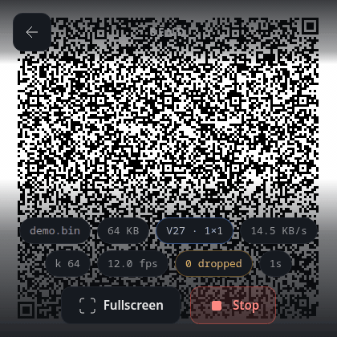
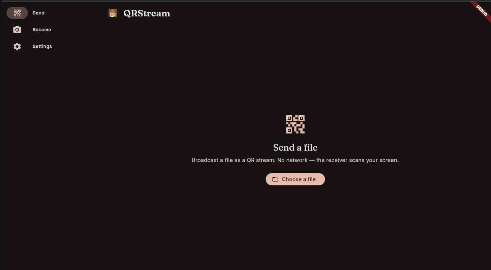
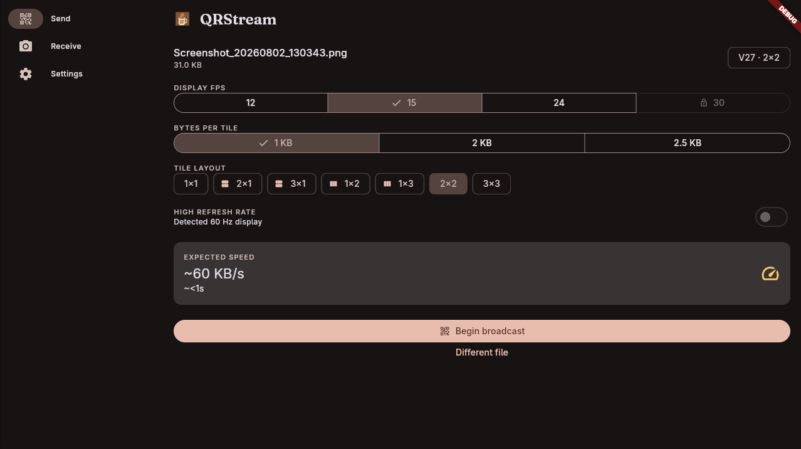
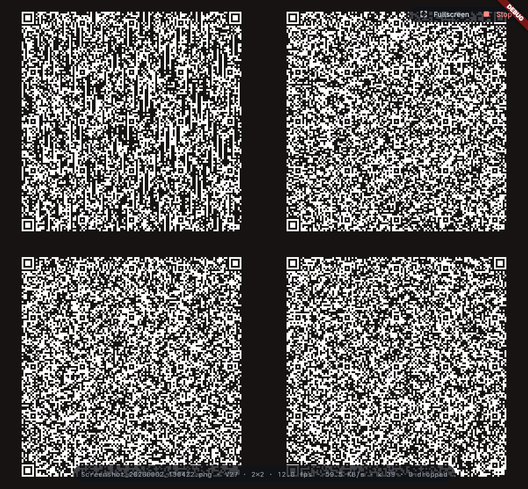
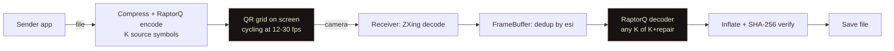
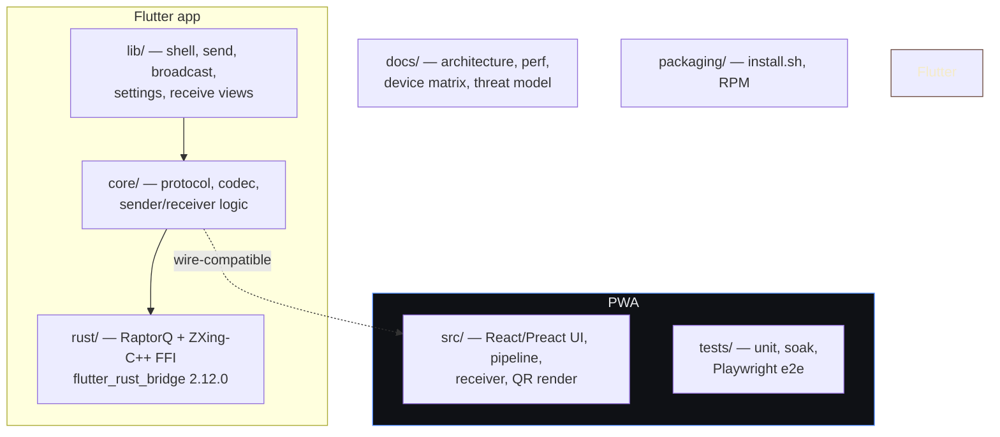

<div align="center">

<picture>
  <source media="(prefers-color-scheme: dark)" srcset="logo-white.png">
  <source media="(prefers-color-scheme: light)" srcset="logo.png">
  
</picture>

# QRStream

**Move files from one screen to another — as a continuous stream of QR codes.**

No network. No pairing. No server. One device broadcasts the file as a cycling
grid of QR codes; the other points its camera at the screen and the file
reassembles itself — RaptorQ fountain codec, SHA-256 verified, fully offline.

</div>

<p align="center">
  <a href="https://flutter.dev"></a>
  <a href="https://react.dev"></a>
  <a href="https://rust-lang.org"></a>
  <a href="LICENSE"></a>
  <br>
  <a href="https://github.com/BlackPool25/QRStream/actions/workflows/ci.yml"></a>
  <a href="https://github.com/BlackPool25/QRStream/releases"></a>
  <a href="https://github.com/BlackPool25/QRStream/releases"></a>
</p>

<p align="center">
  <i>Broadcast → scan → verified. Bytes never leave the room.</i>
</p>

<p align="center">
  <a href="#install">Install</a> · <a href="#demo">Demo</a> · <a href="#features">Features</a> · <a href="#customising-a-broadcast">Customising a broadcast</a> · <a href="#how-it-works">How it works</a> · <a href="#honest-throughput">Honest throughput</a> · <a href="#documentation">Docs</a> · <a href="#contributing">Contributing</a> · <a href="#license">License</a>
</p>

---

## Demo

The QR grid you point your camera at — live, cycling:



QRStream is two apps that speak the same wire protocol:

- **The Flutter app** (Linux desktop, Android, Windows) — the flagship. Real
  native UI, real window fullscreen, native ZXing-C++ decoding.
- **The PWA** (any modern browser) — the zero-install demo and interop
  reference. Visually and wire-compatible with the Flutter app.

### The Flutter app

<p align="center">
  
  
  
</p>

### Receiving

<p align="center">
  
  
</p>

## Install

### Linux (recommended: one line)

```bash
curl -fsSL https://raw.githubusercontent.com/BlackPool25/QRStream/main/install.sh | bash
```

Installs the latest release to `~/.local/share/qrstream`, registers a launcher

- icon, and puts a `qrstream` command on your PATH. No root needed. Verifies
  the download against the release checksums. Uninstall:

```bash
rm -rf ~/.local/share/qrstream ~/.local/bin/qrstream \
       ~/.local/share/applications/qrstream.desktop \
       ~/.local/share/icons/hicolor/256x256/apps/qrstream.png
```

Fedora/RHEL users can also `sudo dnf install ./qrstream-*.rpm` from the
[release page](https://github.com/BlackPool25/QRStream/releases).

### Android

Grab `app-release.apk` from the [latest release](https://github.com/BlackPool25/QRStream/releases/latest)
and sideload it (Settings → Security → install unknown apps).

### Windows

Download `qrstream-<version>-windows-setup.exe` (the installer) — or the
portable `qrstream-windows-x64.zip` — from the
[latest release](https://github.com/BlackPool25/QRStream/releases/latest).

The installer and zip bundle the MSVC runtime app-local, so no Visual C++
Redistributable install is needed; the brand icon is embedded in the exe.

> **Windows Defender / SmartScreen:** QRStream ships unsigned (a code-signing
> certificate costs money an OSS project doesn't have), so Defender may flag
> the download with a *false-positive* `Trojan:Script/Wacatac.B!ml` warning —
> a known machine-learning heuristic that repeatedly hits unsigned Flutter and
> Rust binaries, not an actual infection. If you see it:
>
> 1. Windows Security → **Protection history** → the alert → **Allow on device**.
> 2. SmartScreen "Windows protected your PC" → **More info → Run anyway**.
>
> The binaries are also submitted to the Microsoft Security Intelligence
> false-positive portal after each release to train Defender's model.

No install needed at all? The **PWA** runs in any modern browser (Chrome/Edge
can install it as an app) — open it on the [deployed demo](https://github.com/BlackPool25/QRStream)
and it works fully offline after first load.

### All downloads

Every release ships the Android APK, the Linux tarball, the Fedora/RHEL RPM,
the Windows installer + zip, and a `SHA256SUMS` checksum file:

[**Download QRStream on GitHub Releases →**](https://github.com/BlackPool25/QRStream/releases)

## Quick start (from source)

```bash
# Flutter app (Linux/Android/Windows)
cd flutter_app
flutter pub get
flutter run -d linux          # or -d <android-device>, or -d windows

# PWA (the web demo)
npm install
npm run dev                   # localhost — camera needs a secure context
```

For the full build — platform scaffolding, the Rust codec, icon generation and
the flutter_rust_bridge version-lock contract — see
[`flutter_app/README.md`](flutter_app/README.md).

### Try it

1. Open QRStream on **Sender** on one device, pick a file, hit **Begin
   broadcast**. Hold it toward the other device.
2. On the other device, open **Receiver**, allow the camera, point it at the
   sender's screen — 15–30 cm away, steady.
3. Watch the unique-symbol count climb; when it completes you get a
   **✓ VERIFIED (SHA-256)** badge. Tap **Save file**.


## Features

- **Zero network.** The transfer path never touches a socket. Both devices can
  be in airplane mode after first load.
- **No pairing, no handshake.** Point a camera at the screen and it just
  works — a receiver can join mid-broadcast.
- **No data loss.** Every frame is CRC-32C checked, erasures are repaired by a
  RaptorQ fountain codec, and the reassembled file is SHA-256 verified before
  it is ever offered for saving. A mismatch is surfaced, never silently saved.
- **No encryption — deliberately.** Same-room visual broadcast; anything the
  camera can see can be read. See the [threat model](docs/THREAT-MODEL.md).
- **Tunable throughput.** Display fps, bytes per tile, and tile layout trade
  speed against how much the camera has to resolve — with a live speed/ETA
  estimate (see [Customising a broadcast](#customising-a-broadcast)).
- **Everything on device.** The sender and receiver never contact a server;
  after the first load, the PWA works fully offline too.

## Customising a broadcast

The settings panel (send flow) trades **rate against camera resolution** — more
data per tick means each QR is denser and needs a sharper, steadier view:

| Setting               | Options                           | What it does                                                                                                                                                                                       |
| --------------------- | --------------------------------- | -------------------------------------------------------------------------------------------------------------------------------------------------------------------------------------------------- |
| **Display fps**       | 12 / 15 / 24 / 30                 | The broadcast cadence. 30 needs a 90 Hz+ display (the high-refresh toggle); on 60 Hz even 15 renders at a measured ~12 fps.                                                                        |
| **Bytes per tile**    | 1 / 2 / 2.5 KB                    | The QR symbol size (V27 / V34 / V40). Bigger tiles carry more data per QR but need a sharper view.                                                                                                 |
| **Tile layout**       | 1×1, 2×1, 1×2, 3×1, 1×3, 2×2, 3×3 | Tiles per frame (rows × columns). More tiles = more data per tick, each smaller on screen. Portrait phones get a column (1×3) suggested; landscape a row (3×1) or 2×2; 3×3 only on large canvases. |
| **High refresh rate** | on / off                          | Auto-on at 90/120 Hz; the gate for 30 fps.                                                                                                                                                         |

The panel shows a live **expected speed** (`~KB/s · ~ETA`) for your selection —
a guide, not a promise: the real rate depends on screen brightness, how close
and steady the receiver is, and the px/module the camera actually sees.

Per-file settings live in the send flow; a **Settings** tab persists your
defaults. Changing bytes-per-tile re-encodes the file (it changes the QR tile
size); changing fps/layout alone does not.

## How it works



The sender compresses and fountain-encodes the file into K symbols, then
broadcasts them as an endless cycling grid of QR codes (metadata is re-emitted
every 32 ticks so receivers can join late). The receiver decodes each QR with
ZXing, feeds the symbols to a RaptorQ decoder, and — any K of the
K+repair symbols — rebuilds the file. Integrity is layered: per-frame CRC-32C,
fountain erasure resilience, and a whole-file SHA-256 gate before saving.

- [Architecture](docs/ARCHITECTURE.md) — the full system design and wire protocol
- [ADR: why RaptorQ](docs/decisions/raptorq.md) — the fountain-codec adoption spike
- [Threat model](docs/THREAT-MODEL.md) — what "no encryption" means

## Honest throughput

This is a QR code stream — it is slow, on purpose. Measured, not promised
([docs/PERF.md](docs/PERF.md), Playwright headless Chromium via a virtual camera):

| File                 | Wall time | Effective rate |
| -------------------- | --------- | -------------- |
| 1 MiB random         | ~23 s     | ~46 KB/s       |
| 512 KiB random       | ~12 s     | ~44 KB/s       |
| 256 KiB compressible | ~4.7 s    | ~56 KB/s       |
| 64 KiB random        | ~3.3 s    | ~20 KB/s       |

Rates are dominated by broadcast cadence, not decode cost: the default 2×2
grid at 1 KB tiles runs at a measured 12 fps on a 60 Hz display → ~48 symbols/s
≈ ~48 KB/s raw, with the decoder's budget ~27× under. Files up to a few MB
transfer in a couple of minutes; the wire format caps a single transfer at
**16 MiB**.

## Project structure



## Documentation

- [Architecture & wire protocol](docs/ARCHITECTURE.md)
- [Measured performance envelope](docs/PERF.md)
- [Device/camera matrix](docs/DEVICE-MATRIX.md)
- [Threat model](docs/THREAT-MODEL.md)
- [Flutter app build & codec](flutter_app/README.md)

## Contributing

Small, focused project with a few ground rules — the wire format is a contract,
the transfer path stays socket-free, and every change ships with tests
([CONTRIBUTING.md](CONTRIBUTING.md)). Bugs and ideas welcome via
[issues](https://github.com/BlackPool25/QRStream/issues).

## License

QRStream is licensed under the [MIT License](LICENSE). Third-party components
(RaptorQ, ZXing, the QR generator, pako) are credited in
[THIRD_PARTY_NOTICES.md](THIRD_PARTY_NOTICES.md).

> QRStream is a trademark of the project; the name is not covered by the MIT
> license.
